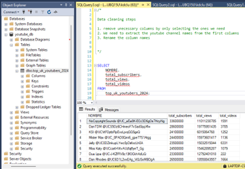
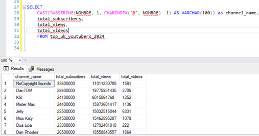
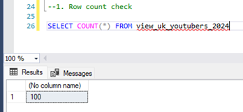
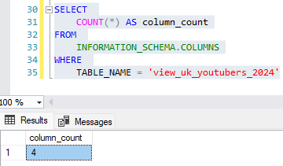
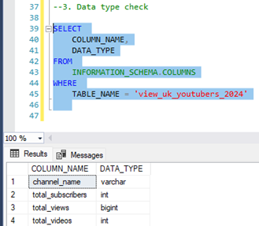
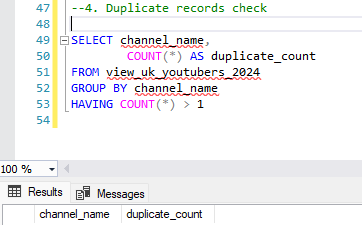
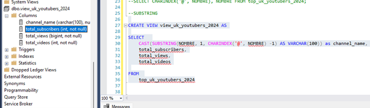

# Data Portfolio: Excel to Power BI

This is my portfolio website, hope you take something from it!

## **1. Data Extraction from SQL Server**
To extract relevant YouTube data, we performed several **SQL transformations**:

- **Extracting YouTube Channel Names**  
  Used `SUBSTRING()` and `CHARINDEX()` to isolate channel names from emails.
  
  Step 1: List all rows for the selected columns needed
  

  Step 2: We get Rid of the unecessary text after the "@" symbol and cast our strings
  
  
- **Data Quality Check (Most Important Aspect)**
  - **Data Record Count Check** – Ensuring data has 100 records.
    
    
  - **Column Count Check** – Verified the correct structure using `INFORMATION_SCHEMA`.
    
    
  - **Data Type Check** – Ensuring the right data type for names in our columns.
    
    
  - **Duplicate Removal Check** – We make sure there aren't any duplicate records.
    
  
  - ✅**Created a SQL View** that serves as the source for Power BI.
    

---

## **2. Power BI Visualizations**
After data extraction, we imported the cleaned dataset into **Power BI** to create interactive dashboards.  

### **DAX Expressions**
This section includes key DAX expressions used in the Power BI reports to calculate metrics such as total views, engagement rates, and revenue estimates.

  - **Measure For Total Subscribers in Millions**

### **Key Visual type Designs**:
- **Table View**: Displays all available YouTube data.
- **Treemap**: Shows **Top 20 YouTube Channels** by total views.
- **Scorecard**: Highlights key statistics such as **Total Subscribers, Total Views, and Engagement Rate**.
- **Horizontal Bar Chart**: Displays **Top 10 Channels by Subscribers**.

🎨 **Dashboard Formatting & UX Improvements**:
- Renamed column headers for clarity.
- Adjusted X/Y-axis ranges.
- Applied conditional formatting with YouTube-themed colors.
- Enabled cross-filtering – clicking on a channel filters the entire dashboard.

---

## **3. Excel Data Analysis**
To further analyze **business insights**, we imported Power BI results into Excel.

**Metrics Computed:**
- **Conversion Rate**: Measures how many viewers purchase a product after watching a video.
- **Campaign Cost**: Amount spent per influencer.
- **Potential Product Sales per Video**: (Avg. views per video) × (Conversion rate).
- **Potential Revenue per Video**: (Product Sales) × (Product Cost).
- **Net Profit**: (Revenue) - (Campaign Cost).

✅ **Excel Formatting Enhancements**:
- Shortcuts for efficient formatting (e.g., `ALT + H + M + C` to center text).
- Conditional formatting applied to highlight revenue trends.

---

## **4. SQL & Excel Cross-Validation**
📊 Final validation step:  
- Compared **Excel outputs with SQL results** for consistency.
- Performed validation checks in SQL Result Window.

---

## **5. Screenshots of the Workflow**
Below are key proof-of-work screenshots extracted from our analysis:

> _(Attach relevant images here)_

---

## **Conclusion**
This project provided a **data-driven approach** to analyzing YouTube channels. By integrating **SSMS, Power BI, and Excel**, we gained actionable insights into subscriber engagement and revenue potential.

### **🚀 Technologies Used**
- SQL Server (SSMS)  
- Power BI  
- Microsoft Excel  

---

## **Author**
📌 Developed by [Musa Ceesay]  

---
