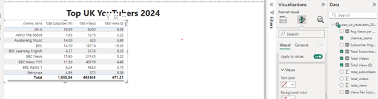
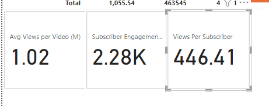
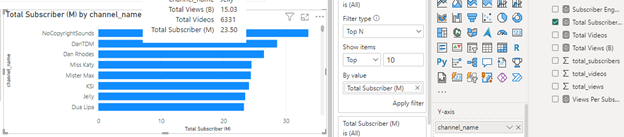
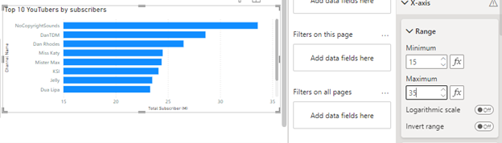
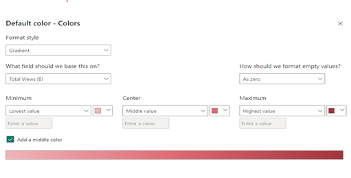
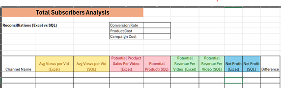
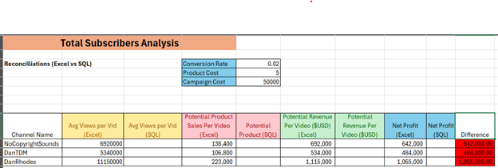

# Data Portfolio: Excel to Power BI


## **1. Data Extraction from SQL Server**
To extract relevant YouTube data, we performed several **SQL transformations**:

- **Extracting YouTube Channel Names**  
  Used `SUBSTRING()` and `CHARINDEX()` to isolate channel names from emails.
  
  Step 1: List all rows for the selected columns needed
  

  Step 2: We get Rid of the unecessary text after the "@" symbol and cast our strings
  
  
  ### *Data Quality Check (Most Important Aspect)*
  - **Data Record Count Check** – Ensuring data has 100 records.
    
    
  - **Column Count Check** – Verified the correct structure using `INFORMATION_SCHEMA`.
    
    
  - **Data Type Check** – Ensuring the right data type for names in our columns.
    
    
  - **Duplicate Removal Check** – We make sure there aren't any duplicate records.
    
  
  - ✅**Created a SQL View** that serves as the source for Power BI.
    

---

## **2. Power BI Visualizations**
After data extraction, we imported the cleaned dataset into **Power BI** to create interactive dashboards.  

### *DAX Expressions*
This section includes key DAX expressions used in the Power BI reports to calculate metrics such as total views, engagement rates, and revenue estimates.

  - **Total Subscribers in Millions**
    ```DAX
    Total Subscribers (M) = 
    VAR million = 1000000
    VAR sumOfSubscribers = SUM(view_uk_youtubers_2024[total_subscribers])
    VAR totalSubscribers = DIVIDE(sumOfSubscribers,million)

    RETURN totalSubscribers
    ```

  - **Total Views in Billions**
    ```DAX
    Total Views (B) = 
    VAR billion = 1000000000
    VAR sumOfTotalViews = SUM(view_uk_youtubers_2024[total_views])
    VAR totalViews = ROUND(sumOfTotalViews / billion, 2)

    RETURN totalViews
    ```

  - **Total Videos Uploaded**
    ```DAX
    Total Videos = 
    VAR totalVideos = SUM(view_uk_youtubers_2024[total_videos])

    RETURN totalVideos
    ```


  - **Average Views Per Video in Millions(how many views each video generates)**
    ```DAX
    Average Views per Video (M) = 
    VAR sumOfTotalViews = SUM(view_uk_youtubers_2024[total_views])
    VAR sumOfTotalVideos = SUM(view_uk_youtubers_2024[total_videos])
    VAR  avgViewsPerVideo = DIVIDE(sumOfTotalViews,sumOfTotalVideos, BLANK())
    VAR finalAvgViewsPerVideo = DIVIDE(avgViewsPerVideo, 1000000, BLANK())

    RETURN finalAvgViewsPerVideo
    ``` 


  - **Subscriber Engagement Rate(How often subscribers engage with content)**
    ```DAX
    Subscriber Engagement Rate = 
    VAR sumOfTotalSubscribers = SUM(view_uk_youtubers_2024[total_subscribers])
    VAR sumOfTotalVideos = SUM(view_uk_youtubers_2024[total_videos])
    VAR subscriberEngRate = DIVIDE(sumOfTotalSubscribers, sumOfTotalVideos, BLANK())

    RETURN subscriberEngRate
    ```


  - **Views Per Subscriber**
    ```DAX
    Views Per Subscriber = 
    VAR sumOfTotalViews = SUM(view_uk_youtubers_2024[total_views])
    VAR sumOfTotalSubscribers = SUM(view_uk_youtubers_2024[total_subscribers])
    VAR viewsPerSubscriber = DIVIDE(sumOfTotalViews, sumOfTotalSubscribers, BLANK())

    RETURN viewsPerSubscriber
    ``` 


### *Key Visual type Designs*:
- **Table View**: Displays all available YouTube data.
  
  
- **Treemap**: Shows **Top 20 YouTube Channels** by total views.
  
  
- **Scorecard**: Highlights key statistics such as **Total Subs, Total Views, and Engagement Rate**.
  
  
- **Horizontal Bar Chart**: Displays **Top 10 Channels by Subscribers**.
  

🎨 **Dashboard Formatting & UX Improvements**:
- Renamed column headers for clarity and Adjusted X/Y-axis ranges.
  
  
- Applied conditional formatting with YouTube-themed colors.
  
  
- Enabled cross-filtering – clicking on a channel filters the entire dashboard.
  

### *What we have discovered*:
  With further analysis into the dashboard we have determined that the top three youtube channels with the most subscribers are NoCopyrightSounds with 33.6M subscribers, DanTDM with 28.6M, and Dan Rhodes with 26.5M. With these channels we are going to use the Avg views per video (in millions) from each of the three channels to further our analysis for our client.
---

## **3. Excel Data Analysis**
To further analyze **business insights**, we imported Power BI results into Excel.

**Metrics Computed:**
- **Conversion Rate**: Measures how many viewers purchase a product after watching a video. In this case we are going to say 2% of viewers purchased the product
- **Campaign Cost**: Amount spent per influencer. We are going to say $50,000 for each influencer
- **Potential Product Sales per Video**: How many products we can sell knowing how much views they average per video. (Avg. views per video) × (Conversion rate).
- **Potential Revenue per Video**:How much money we can make (Product Sales) × (Product Cost).
- **Net Profit**: (Potential Revenue) - (Campaign Cost).
  
  
  

✅ **Excel Formatting Enhancements**:
- Shortcuts for efficient formatting (e.g., `ALT + H + M + C` to center text).
- Conditional formatting applied to highlight revenue trends.
  
  

---

## **4. SQL & Excel Cross-Validation**
📊 Final validation step:  Now the same outputs we determined in Excel will now be determined using SQL
- Compared **Excel outputs with SQL results** for consistency.
- Performed validation checks in SQL Result Window.

---

## **5. Screenshots of the Workflow**
Below are key proof-of-work screenshots extracted from our analysis:

> _(Attach relevant images here)_

---

## **Conclusion**
This project provided a **data-driven approach** to analyzing YouTube channels. By integrating **SSMS, Power BI, and Excel**, we gained actionable insights into subscriber engagement and revenue potential.

### **🚀 Technologies Used**
- SQL Server (SSMS)  
- Power BI  
- Microsoft Excel  

---

## **Author**
📌 Developed by [Musa Ceesay]  

---
